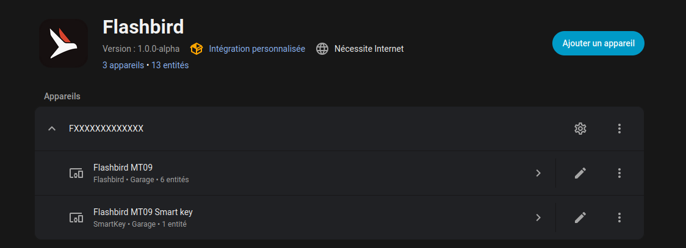
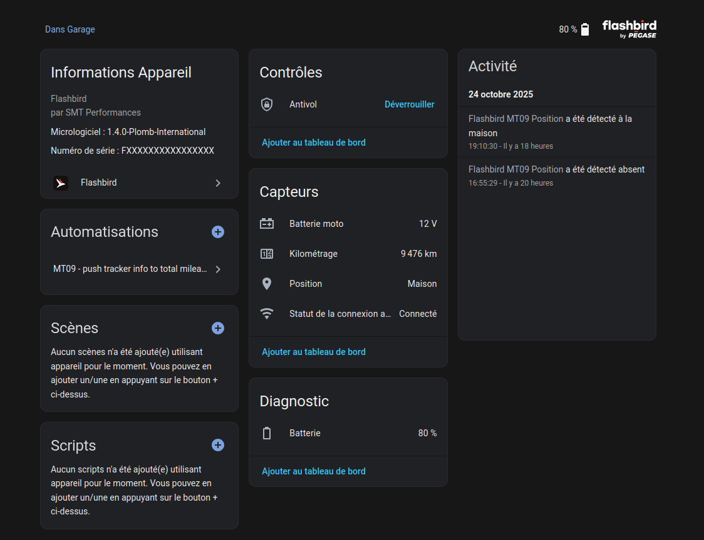
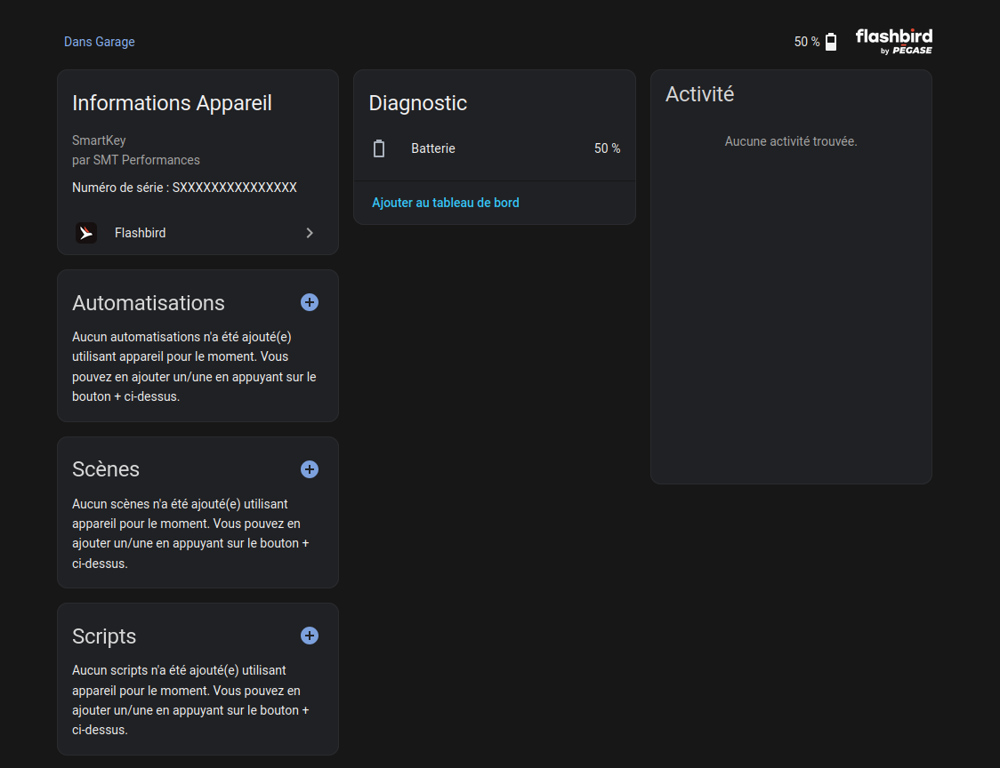

# Flashbird Home assistant integration

[![Stable][releases-shield]][releases] [![HACS Badge][hacs-badge]][hacs-link] ![Project Maintenance][maintenance-shield] [![GitHub Activity][commits-shield]][commits]

[commits-shield]: https://img.shields.io/github/commit-activity/y/gorfo66/flashbird-homeassistant.svg
[commits]: https://github.com/gorfo66/flashbird-homeassistant/commit/main
[maintenance-shield]: https://img.shields.io/maintenance/yes/2025.svg
[releases-shield]: https://img.shields.io/github/v/release/gorfo66/flashbird-homeassistant.svg
[releases]: https://github.com/gorfo66/flashbird-homeassistant/releases/tag/1.1.0
[hacs-badge]: https://img.shields.io/badge/HACS-Default-41BDF5.svg
[hacs-link]: https://hacs.xyz/

SMT Performance is a French company that delivers a motor bike tracker called "Flashbird".
You can have more inforamtion regarding this brand here: [https://smtperformances.fr/](https://smtperformances.fr/)

## The sensors
The integration provides several sensors:
- tracker : exposes the GPS coordinate of the tracker
- mileage: exposes the total mileage (in km) made by the tracker
- lock: enable or disable the alerting
- connected status: exposes if the tracker is connected to the network or not
- battery level: exposes the current battery level of the tracker
- bike battery: exposes the battery voltage of the bike
- smartKey battery: exposes the battery level of the Smart key associated to the tracker

- last refresh date: exposes the last datetime the data was updated either from websocket or from api
- refresh rate: exposes the average refresh rate of the last 10 minutes

### How it looks like in Home assistant

## Fetching data
The data is fetched every hour from the Flashbird API.

In between, a websocket connexion is in charge to listen data and update sensors "live".
The websocket streams all the data that the tracker sends to the server. The frequency of update depends on the state of tracker (if the bike moves, more data is sent, if the bike doesn't move, there is 1 hit every 5min). To prevent tsunami wave on Homeassistant, we are throttling the number of request and updating maximum every 5 seconds. The refresh date helps you determining how often the data is updated

## How to use
Once the Flashbird integration is added into Homeassistant you just need to click on the "Add integration" button, search for Flashbird and fill the information presented in the connexion screen (login / password / serial number of the tracker / name of the tracker). 

The login and password will not be stored in the system but used to generate a token. When the token will be revoked by Flashbird API, you will be prompted to login again.

The Serial number can be found in the Flashbird mobile app.

The name of the tracker will just be used in Home assistant to prefix all the entity ids.

Once you complete the process, 2 new devices will be created, one for the tracker, and one for its smart key.

## Licencing / Bug reporting
This project is open source and done only on spare time, so do not expect bug free extension.
Feel free to contribute if you are interested.